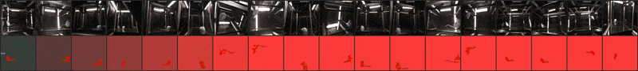
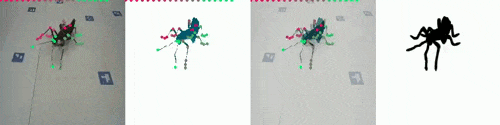

# SMILify

This repository is based on [SMALify](https://github.com/benjiebob/SMALify) with the aim to turn any rigged 3D model into
a SMAL compatible model. There are Blender files to convert your mesh and lots of code
changes to deal with arbitrary armature configurations, rather than assuming a fixed
quadruped model.

For now, I'll focus on insects, hence **SMIL**.

## Neural Inference Examples

Multi-view 3D reconstruction using neural inference:

 

Example 18 camera inference results, using a newly developed [parametric mouse model](3D_model_prep/SMILy_Mouse_static_joints_Falkner_conv_repose_hind_legs.pkl)



Example 4-5 camera inference results with a molde trained on data collected from an Omni-Directional Treadmill (ODT) using a [parametric multi species stick insect model](3D_model_prep/SMILy_STICK.pkl) configured with the [Blender SMIL Addon](3D_model_prep/SMIL_processing_addon.py).


## Installation
1. Clone the repository **with submodules** and enter directory
   ```
   git clone https://github.com/FabianPlum/SMILify
   ```
   Note: If you don't clone with submodules you won't get the sample data from BADJA/StanfordExtra/SMALST.

2. install pytorch (and Co.)
   ```
   conda create -n pytorch3d python=3.10
   conda activate pytorch3d
   conda install pytorch=2.3.1 torchvision torchaudio pytorch-cuda=11.8 -c pytorch -c nvidia
   conda install -c conda-forge -c fvcore iopath ninja imageio scikit-image
   pip install yacs pycocotools
   pip install --upgrade iopath
   ```

3. clone pytorch3d and install (WINDOWS)
   
   **NOTE**: I've never gotten this to work properly on Windows. I'd recommend using [WSL2](https://learn.microsoft.com/en-us/windows/wsl/) or making an Ubuntu partition.
   If by what ever dark magic you posess you manage to run this on Win11, please open a PR and share your arcane wisdom.
   ```
   git clone https://github.com/facebookresearch/pytorch3d.git
   cd pytorch3d
   pip install -e .
   cd ..
   ```
   
   on LINUX just run
   ```
   conda install pytorch3d -c pytorch3d
   ```

4. some more dependencies
   ```
   pip install matplotlib scipy opencv-python nibabel trimesh timm pytest h5py psutil
   ```
   
5. Test your installation
   ```
   pytest tests/ -v -s
   ```

## Dataset preprocessing

SMILify uses [SLEAP](https://sleap.ai/) for 2D pose estimation and expects data to be preprocessed into an optimised HDF5 format before training.
Two preprocessing scripts are provided:

- [smal_fitter/sleap_data/preprocess_sleap_multiview_dataset.py](smal_fitter/sleap_data/preprocess_sleap_multiview_dataset.py) — **multi-view** (recommended)
- [smal_fitter/sleap_data/preprocess_sleap_dataset.py](smal_fitter/sleap_data/preprocess_sleap_dataset.py) — single-view

### Input directory structure

The script expects a top-level **sessions directory** containing one sub-folder per recording session.
Each session folder must follow the SLEAP multi-view layout (one sub-folder per camera, each containing the video and `.slp` / `.h5` prediction files, plus a `calibration.toml` and `points3d.h5` for 3D data).

Two optional lookup-table CSV files should be placed directly in the sessions directory:

```
/path/to/sessions/
├── joint_lookup.csv               # maps model joints → SLEAP keypoint names
├── shape_betas.csv                # maps session names → ground-truth shape betas (optional)
├── session_001/                   # one recording session
│   ├── calibration.toml           # multi-camera calibration (required for 3D)
│   ├── points3d.h5                # 3D keypoints from anipose / SLEAP 3D
│   ├── Camera0/
│   │   ├── video.mp4
│   │   └── video.mp4.predictions.slp
│   ├── Camera1/
│   │   └── ...
│   └── ...
├── session_002/
│   └── ...
└── ...
```

### Lookup tables

**`joint_lookup.csv`** — maps every joint in the SMIL/SMAL model to the corresponding keypoint label used in your SLEAP project.
Leave the `data` column empty for joints that have no annotated equivalent.

| model | data |
|---|---|
| skull | Head |
| Ear_L_tip | Ear_L |
| Ear_R_tip | Ear_R |
| Nose | Nose |
| humerus_L | Shoulder_L |
| tibia_L | Knee_L |
| Tail_01 | TTI |
| Tail_07 | TailTip |
| Lumbar-Vertebrae | _(unmapped)_ |
| … | … |

**`shape_betas.csv`** — optionally provides ground-truth shape principal components for each session.
The `label` column must match the session sub-folder name exactly.

| label | PC1 | PC2 | PC3 |
|---|---|---|---|
| session_001 | 0.95 | 0.51 | 0.85 |
| session_002 | 0.50 | 0.51 | 0.85 |

### Running the multi-view preprocessor 
_(Example command, using only the first 500 frames of a multi-view session. Remove the '--max_frames_per_session', if you wish to use the complete dataset)_

```bash
python smal_fitter/sleap_data/preprocess_sleap_multiview_dataset.py \
    /path/to/sessions \
    output_dataset.h5 \
    --joint_lookup_table /path/to/sessions/joint_lookup.csv \
    --shape_betas_table  /path/to/sessions/shape_betas.csv \
    --smal_file          3D_model_prep/SMILy_STICK.pkl \
    --max_frames_per_session 500
```

**Key arguments:**

| Argument | Default | Description |
|---|---|---|
| `sessions_dir` | _(required)_ | Directory containing session sub-folders |
| `output_path` | _(required)_ | Output `.h5` file path |
| `--joint_lookup_table` | None | CSV mapping model joints → SLEAP keypoint names |
| `--shape_betas_table` | None | CSV with per-session ground-truth shape betas |
| `--smal_file` | _(config)_ | Path to SMIL/SMAL model `.pkl` file |
| `--max_frames_per_session` | all | Cap frames per session (useful for quick tests) |
| `--frame_skip` | 1 | Use every Nth synchronised frame |
| `--min_views` | 2 | Minimum camera views required per sample |
| `--crop_mode` | `default` | `default` · `centred` · `bbox_crop` |
| `--target_resolution` | 224 | Output image resolution in pixels |
| `--no_3d_data` | False | Skip loading 3D keypoints and camera parameters |
| `--no_undistort` | False | Skip lens-distortion correction |
| `--confidence_threshold` | 0.5 | Minimum SLEAP keypoint confidence to mark as visible |

For the **single-view** case use `preprocess_sleap_dataset.py` with the same `sessions_dir` / `output_path` positional arguments; it accepts `--num_workers` for parallel processing and `--use_reprojections` to substitute raw SLEAP predictions with reprojected 2D coordinates from a `reprojections.h5` file.

## Training

Training is driven by [smal_fitter/neuralSMIL/train_multiview_regressor.py](smal_fitter/neuralSMIL/train_multiview_regressor.py).
Everything — model, dataset, optimiser, loss curriculum, output paths — is configured through a single JSON file (see [smal_fitter/neuralSMIL/configs/examples/multiview_baseline.json](smal_fitter/neuralSMIL/configs/examples/multiview_baseline.json) for an annotated example).
In practice the only CLI argument you usually need is `--num_gpus` to match the hardware available on your system:

```bash
python smal_fitter/neuralSMIL/train_multiview_regressor.py \
    --config smal_fitter/neuralSMIL/configs/examples/multiview_baseline.json \
    --num_gpus 2
```

Training resumes automatically from `training.resume_checkpoint` if set in the config. You can also pass it on the CLI:

```bash
python smal_fitter/neuralSMIL/train_multiview_regressor.py \
    --config smal_fitter/neuralSMIL/configs/examples/multiview_baseline.json \
    --resume_checkpoint multiview_checkpoints/best_model.pth
```

Alternatively, launch via `torchrun` for cluster use (ignores `--num_gpus`):

```bash
torchrun --nproc_per_node=4 smal_fitter/neuralSMIL/train_multiview_regressor.py \
    --config smal_fitter/neuralSMIL/configs/examples/multiview_baseline.json
```

### Config file structure

| Section | Key fields | Purpose |
|---|---|---|
| `smal_model` | `smal_file` | Path to the SMIL/SMAL `.pkl` model |
| `dataset` | `data_path`, `train_ratio`, `val_ratio`, `test_ratio` | Dataset file and split ratios |
| `model` | `backbone_name`, `freeze_backbone`, `head_type`, `hidden_dim` | Network architecture |
| `optimizer` | `learning_rate`, `weight_decay`, `lr_schedule` | Optimiser and epoch-based LR schedule |
| `loss_curriculum` | `base_weights`, `curriculum_stages` | Per-loss weights stepped at specified epoch boundaries |
| `training` | `batch_size`, `num_epochs`, `num_workers`, `resume_checkpoint`, `use_gt_camera_init` | Training loop settings |
| `output` | `checkpoint_dir`, `visualizations_dir`, `save_checkpoint_every` | Where to write outputs |
| `joint_importance` | `important_joint_names`, `weight_multiplier` | Boost loss weight for specific joints |

`loss_curriculum` is the most important section to tune: `base_weights` sets initial loss weights and `curriculum_stages` steps them at given epoch boundaries — e.g. 2D keypoint supervision early on, then gradually introducing 3D supervision once a rough pose is established.

## Inference

### Multi-view

Inference runs on a **pre-processed HDF5 dataset** (the same format produced by the preprocessing step above), which makes it significantly faster than reading raw video frames at inference time.
The script loads the checkpoint automatically from `multiview_checkpoints/best_model.pth` (or `final_model.pth`) unless another path is set in the config.

```bash
python smal_fitter/neuralSMIL/run_multiview_inference.py \
    --dataset output_dataset.h5 \
    --smal_file 3D_model_prep/SMILy_STICK.pkl \
    --num_gpus 2
```

The script writes two output videos to the working directory:
- `<dataset>_multiview_inference.mp4` — side-by-side grid of input frames and predicted mesh overlays for all camera views
- `<dataset>_singleview_inference.mp4` — full mesh render for the first camera (use `--view_indices` to change or add views)

Key arguments:

| Argument | Default | Description |
|---|---|---|
| `--dataset` | _(required)_ | Path to preprocessed `.h5` dataset |
| `--smal_file` | None | SMIL/SMAL model `.pkl` (overrides config) |
| `--num_gpus` | 1 | Number of GPUs (ignored when using `torchrun`) |
| `--view_indices` | `"0"` | Comma-separated view indices for singleview output, e.g. `"0,4,11"` |
| `--fps` | 60 | Output video frame rate |
| `--max_frames` | all | Cap total frames processed (useful for quick checks) |

> **Note:** In future this will be extended to accept synchronised raw video streams directly, removing the need for a pre-processed dataset.

### Single-view

The single-view script works directly on a raw video or a folder of images.
When `--crop_mode bbox_crop` is used, bounding boxes are derived from an existing SLEAP project, tightly cropping each frame around the detected specimen — this is the recommended mode when the model was trained with `bbox_crop`.

```bash
python smal_fitter/neuralSMIL/run_singleview_inference.py \
    --checkpoint checkpoints/best_model.pth \
    --input_video /path/to/video.mp4 \
    --output_folder /path/to/output \
    --sleap_project /path/to/sleap/sessions \
    --crop_mode bbox_crop \
    --max_frames 1000
```

Key arguments:

| Argument | Default | Description |
|---|---|---|
| `--checkpoint` | _(required)_ | Path to trained `.pth` checkpoint |
| `--input_video` / `--input_folder` | _(required, one of)_ | Raw video file or folder of images |
| `--output_folder` | _(required)_ | Directory for results |
| `--crop_mode` | `centred` | `centred` · `default` · `bbox_crop` — must match training preprocessing |
| `--sleap_project` | None | SLEAP session directory (required for `bbox_crop`) |
| `--sleap_camera` | None | Camera name override when using `bbox_crop` with multi-camera data |
| `--max_frames` | all | Cap frames processed |
| `--video_export_mode` | `overlay` | `overlay` (mesh blended onto input) or `side_by_side` |
| `--camera_smoothing` | 0 | Moving-average window for camera parameter smoothing |

> **Note:** For future use cases without SLEAP annotations, a lightweight detector model providing cropped specimen frames would be a natural drop-in replacement for the SLEAP-based bounding box extraction.

## Benchmarking

[smal_fitter/neuralSMIL/benchmark_model.py](smal_fitter/neuralSMIL/benchmark_model.py) evaluates a checkpoint on the held-out test split of a preprocessed HDF5 dataset.
The model type is **auto-detected** from the checkpoint — no flag needed:
- checkpoint contains `view_embeddings.weight` → multi-view
- otherwise → single-view

```bash
python smal_fitter/neuralSMIL/benchmark_model.py \
    --checkpoint multiview_checkpoints/best_model.pth \
    --dataset_path output_dataset.h5 \
    --smal-file 3D_model_prep/SMILy_STICK.pkl
```

**Metrics reported:**

| Metric | Single-view | Multi-view |
|---|---|---|
| PCK@5px | yes | yes |
| PCK curve (1–50 px) | yes | yes |
| MPJPE (mm) | — | yes (when 3D GT available) |
| MPJPE percentiles (P50–P99) | — | yes |

**Output files** are written to `benchmark_{model_type}_{checkpoint}_{dataset}/`:

| File | Description |
|---|---|
| `benchmark_report.txt` | Full text log of all metrics |
| `pck_curve.png` | PCK vs pixel-threshold plot |
| `error_histogram.png` | 2D keypoint error distribution |
| `mpjpe_histogram.png` | 3D joint error distribution (multi-view) |
| `sample_XX_3d_keypoints_percentiles.png` | GT vs predicted 3D joints coloured by error percentile (multi-view) |
| `errors_2d_px.npy` / `errors_3d_mm.npy` | Raw error arrays for custom analysis |

**Key arguments:**

| Argument | Default | Description |
|---|---|---|
| `--checkpoint` | _(required)_ | Path to `.pth` checkpoint |
| `--dataset_path` | _(required)_ | Path to preprocessed `.h5` dataset |
| `--smal-file` | _(checkpoint)_ | SMIL/SMAL model `.pkl` (required if not stored in checkpoint) |
| `--device` | auto | Force device, e.g. `cuda:0` or `cpu` |
| `--orig_width` / `--orig_height` | _(dataset)_ | Override image size used for pixel-space PCK scaling |


# Code refactor TODOs 
- [X] Move all legcay funcitonality and documentation to it's own sub-directory to clean up the repo and make its purpose more apparent.
- [ ] Remove all currently used recursive clones. The repo should work on its own without the need of cloning submodules.
- [ ] If a submodule is needed, we should re-write it and add it to an appropriate subfolder. Otherwise, this repo is entirely un-maintainable.
- [ ] At the moment, the SMAL models require 2 to 3 separate types of data files as well as hard-coded priors for the joint limits. These should be handled more gracefully, like in the new SMIL implementation. All model info should be contained in a single, readable and editable file.
- [X] Get rid of the numpy/chumpy dependency mess.
- [X] Allow importing legacy SMAL models with chumpy variables WITHOUT requiring chumpy to be installed through custom unpickler.
- [ ] Write a conversion script from the old SMAL format consisting of multiple files into our new single file structure containing all the data. I don't care if the files are large, as long as they are readable and first and foremost editable.
- [ ] The code is poorly documented. That needs to be fixed.
- [X] The code is poorly tested. That needs to be fixed. Write integration tests for main functionality.
- [ ] Let's see how far we can get with this in our limited time BUT I would love to re-write this whole thing as a Blender addon. But that's for another day (probably more of a "project wish" than related to refactoring).

## Functionality / broader project TODOs
- [ ] Allow to add user-defined priors for joint limits in the Blender addon.
- [X] Finish cleaning antscan dataset and prepare models for fitting.
- [ ] Create SMIL model from massive antscan dataset.
- [X] Add configurable mouse SMIL model.
- [X] Re-implement multi-GPU mesh registration cleanly.

## Acknowledgements
- [SMALify](https://github.com/benjiebob/SMALify); Biggs et al, the original repo on which this one is based.
This repository owes a great deal to the following works and authors:
- [SMAL](http://smal.is.tue.mpg.de/); Zuffi et al. designed the SMAL deformable quadruped template model and have been wonderful for providing advice throughout my animal reconstruction PhD journey.
- [SMPLify](http://smplify.is.tue.mpg.de/); Bogo et al. provided the basis for our original ChumPY implementation and inspired the name of this repo.
- [SMALST](https://github.com/silviazuffi/smalst); Zuffi et al. provided a PyTorch implementations of the SMAL skinning functions which have been used here.


## Contribute
Please create a pull request or submit an issue if you would like to contribute.

## Licensing
(c) Fabian Plum, Imperial College London & Forschungs Zentrum Juelich & scAnt UG

By downloading this codebase and included dataset(s), you agree to the [Creative Commons Attribution-NonCommercial 4.0 International license](https://creativecommons.org/licenses/by-nc-sa/4.0/). This license allows users to use, share and adapt the codebase and dataset(s), so long as credit is given to the authors (e.g. by citation) and the dataset is not used for any commercial purposes.

THIS SOFTWARE AND ANNOTATIONS ARE PROVIDED BY THE COPYRIGHT HOLDERS AND CONTRIBUTORS "AS IS" AND ANY EXPRESS OR IMPLIED WARRANTIES, INCLUDING, BUT NOT LIMITED TO, THE IMPLIED WARRANTIES OF MERCHANTABILITY AND FITNESS FOR A PARTICULAR PURPOSE ARE DISCLAIMED. IN NO EVENT SHALL THE COPYRIGHT OWNER OR CONTRIBUTORS BE LIABLE FOR ANY DIRECT, INDIRECT, INCIDENTAL, SPECIAL, EXEMPLARY, OR CONSEQUENTIAL DAMAGES (INCLUDING, BUT NOT LIMITED TO, PROCUREMENT OF SUBSTITUTE GOODS OR SERVICES; LOSS OF USE, DATA, OR PROFITS; OR BUSINESS INTERRUPTION) HOWEVER CAUSED AND ON ANY THEORY OF LIABILITY, WHETHER IN CONTRACT, STRICT LIABILITY, OR TORT (INCLUDING NEGLIGENCE OR OTHERWISE) ARISING IN ANY WAY OUT OF THE USE OF THIS SOFTWARE, EVEN IF ADVISED OF THE POSSIBILITY OF SUCH DAMAGE.

