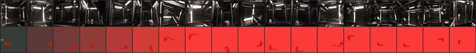
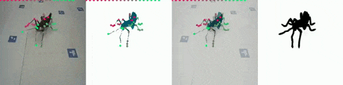
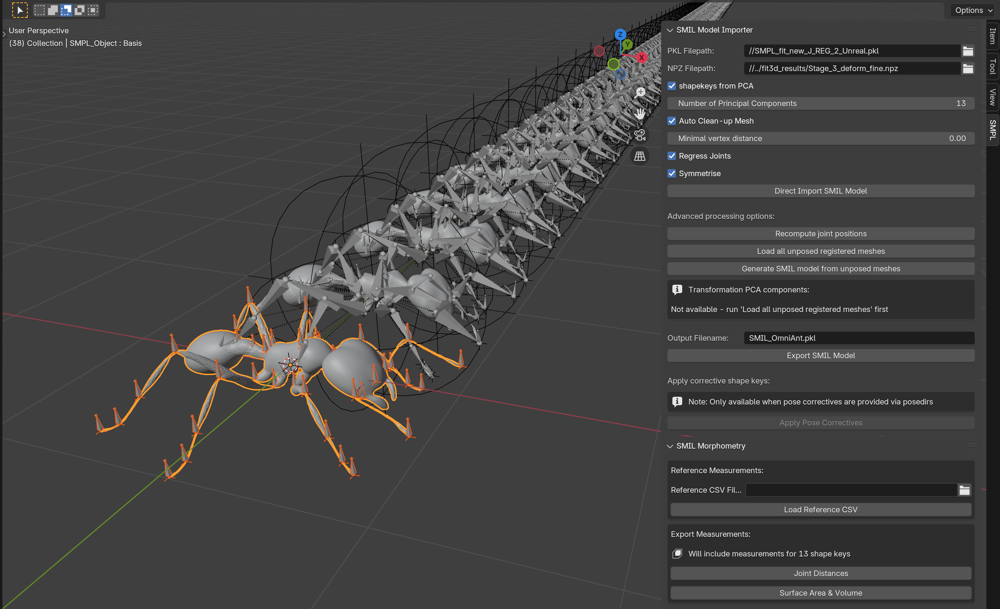
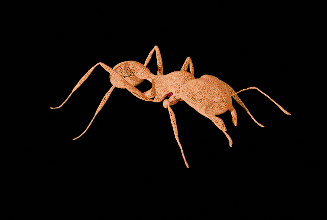
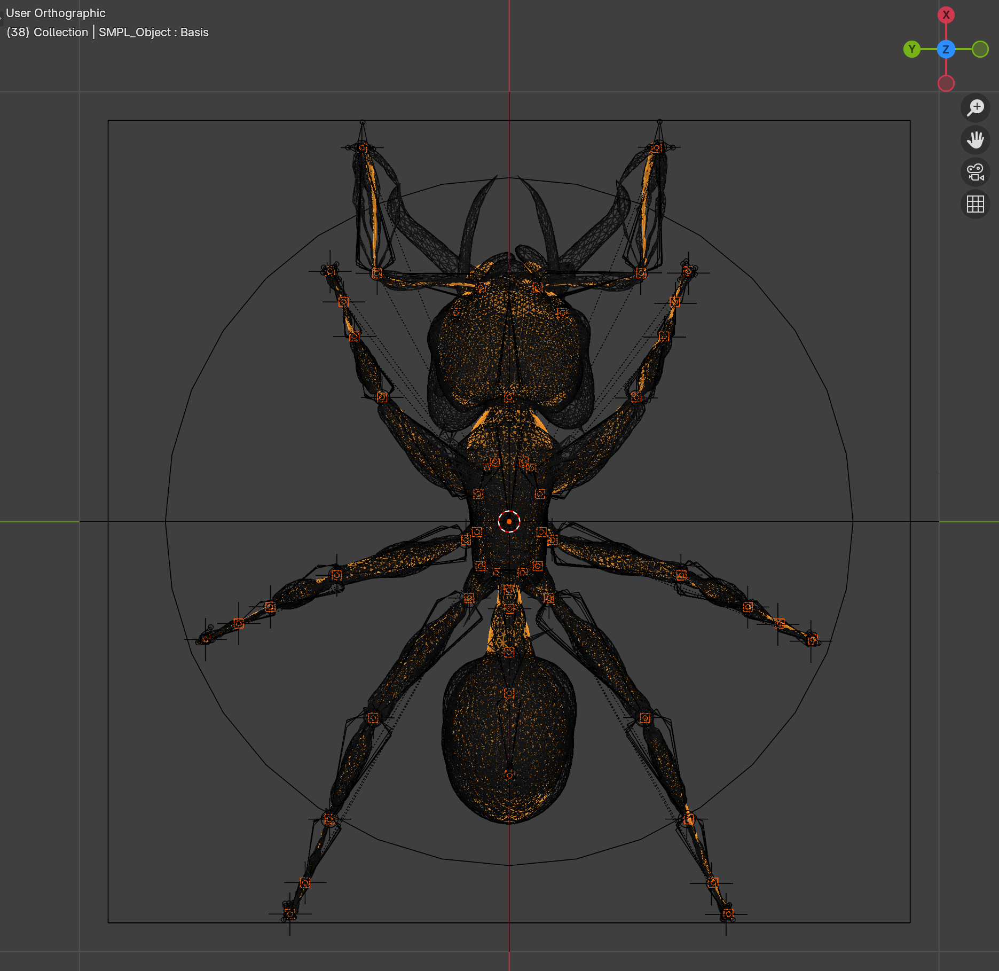

# SMILify

This repository is based on [SMALify](https://github.com/benjiebob/SMALify) with the aim to turn any rigged 3D model into
a SMAL compatible model. There are Blender files to convert your mesh and lots of code
changes to deal with arbitrary armature configurations, rather than assuming a fixed
quadruped model.

For now, I'll focus on insects, hence **SMIL**.

> **New here?** Start with the **[Getting Started guide](GETTING_STARTED.md)** — a step-by-step walkthrough from a fresh clone to (1) installing SMILify, (2) benchmarking a model on an example dataset, and (3) training your own from scratch. The sections below are the full reference.

## Neural Inference Examples

Multi-view 3D reconstruction using neural inference:

 

Example 18 camera inference results, using a newly developed [parametric mouse model](3D_model_prep/SMILy_Mouse_static_joints_Falkner_conv_repose_hind_legs.pkl)



Example 4-5 camera inference results with a model trained on data collected from an Omni-Directional Treadmill (ODT) using a [parametric multi species stick insect model](3D_model_prep/SMILy_STICK.pkl) configured with the [Blender SMIL Addon](3D_model_prep/SMIL_processing_addon.py).


## Repository structure

| Path | What lives here |
|---|---|
| [`smal_fitter/neuralSMIL/`](smal_fitter/neuralSMIL/) | **Neural inference** — learned regressors that predict SMIL parameters from images (single- and multi-view). Training, inference and benchmarking entrypoints live here. |
| [`smal_fitter/fitter.py`](smal_fitter/fitter.py) | **Optimization-based fitting** (`SMALFitter`, an `nn.Module`) — see *Architecture* below. |
| [`smal_fitter/sleap_data/`](smal_fitter/sleap_data/) | SLEAP multi-view preprocessing toolchain + dataset loaders. |
| [`smal_model/`](smal_model/) | The SMAL/SMIL parametric model (differentiable linear-blend skinning). |
| [`fitter_3d/`](fitter_3d/) | 3D **mesh registration** — fits a template model to target `.obj` meshes (used when building new parametric models). |
| [`3D_model_prep/`](3D_model_prep/) | Blender files + the SMIL addon for creating/editing parametric `.pkl` models. |
| [`custom_processing/`](custom_processing/) | Model-preprocessing helpers (mesh registration, beta regressors). |
| [`config.py`](config.py) | Legacy root config — still required by `fitter_3d` and `optimize_to_joints.py`. |
| [`legacy/`](legacy/) | The deprecated SMALify-derived optimization workflow (see [legacy/README.md](legacy/README.md)). |
| [`tests/`](tests/) | Pytest suite (see [tests/README.md](tests/README.md)). |

## Architecture: two fitting approaches

SMILify fits the same `smal_model` (SMAL/SMIL parametric model) in two ways:

1. **Neural inference** ([`smal_fitter/neuralSMIL/`](smal_fitter/neuralSMIL/)) — learned regressors predict SMIL parameters (pose, shape, translation, cameras) directly from RGB images, single- or multi-view. This is the primary, actively-developed path; everything from *Dataset preprocessing* onward in this README describes it. See [smal_fitter/neuralSMIL/README.md](smal_fitter/neuralSMIL/README.md).
2. **Optimization-based fitting** ([`smal_fitter/fitter.py`](smal_fitter/fitter.py), class `SMALFitter`) — an `nn.Module` that optimizes per-frame pose, shape (betas), translation and FOV by gradient descent against 2D-joint reprojection, silhouette and prior losses. Driven by the root [`config.py`](config.py); see [legacy/README.md](legacy/README.md). The related 3D **mesh registration** in [`fitter_3d/`](fitter_3d/) is the optimization pipeline used to author new parametric models.

New parametric models are authored in Blender via the SMIL addon — see *Adding new parametric models* below.


## Installation
The conda environment is defined in [environment.yml](environment.yml). The recommended stack is Python 3.10 / **PyTorch 2.3.1** / pytorch-cuda 11.8 / **PyTorch3D 0.7.8** — confirmed on Windows 11 and the run.ai Linux cluster (PyTorch3D ships a `cu118_pyt231` build, so it installs cleanly against torch 2.3.1 on Linux). An older PyTorch 2.1.1 / PyTorch3D 0.7.7 stack also works if you prefer it.

1. **Clone with submodules.** The sample data for the legacy quadruped path (BADJA / StanfordExtra / SMALST) come in as git submodules:
   ```bash
   git clone --recurse-submodules https://github.com/FabianPlum/SMILify
   cd SMILify
   ```
   (Already cloned without them? Run `git submodule update --init --recursive`.)

2. **Create the environment** (recommended):
   ```bash
   conda env create -f environment.yml
   conda activate pytorch3d
   ```

3. **Test your installation** (run from the repo root):
   ```bash
   pytest tests/ -m "not slow"
   ```
   (See [tests/README.md](tests/README.md).)

> On an HPC cluster you can instead run [`hpc_files/install.sh`](hpc_files/install.sh), which performs the same conda setup end-to-end (supports `--skip-tests` and a configurable `ENV_NAME`).

<details>
<summary><b>Manual / Windows setup</b> (alternative to <code>environment.yml</code>)</summary>

PyTorch3D has no reliable prebuilt Windows conda package — on Windows I'd recommend using [WSL2](https://learn.microsoft.com/en-us/windows/wsl/) or making an Ubuntu partition. If by whatever dark magic you possess you manage to run this on Win11, please open a PR and share your arcane wisdom.

```bash
conda create -n pytorch3d python=3.10
conda activate pytorch3d
# recommended: torch 2.3.1 (Linux + Windows); 2.1.1 also works
conda install pytorch=2.3.1 torchvision pytorch-cuda=11.8 -c pytorch -c nvidia
conda install -c conda-forge -c fvcore iopath ninja imageio scikit-image
conda install pytorch3d -c pytorch3d          # Linux; on Windows build pytorch3d from source
pip install matplotlib scipy opencv-python nibabel trimesh timm pytest h5py psutil pandas toml pycocotools
```
(`pandas` and `toml` are needed by `smal_fitter/sleap_data/` for the multi-view scripts.)
</details>

## Dataset preprocessing

SMILify uses [SLEAP](https://sleap.ai/) for 2D pose estimation and expects data to be preprocessed into an optimised HDF5 format before training.
Two preprocessing scripts are provided:

- [smal_fitter/sleap_data/preprocess_sleap_multiview_dataset.py](smal_fitter/sleap_data/preprocess_sleap_multiview_dataset.py) — **multi-view** (recommended)
- [smal_fitter/sleap_data/preprocess_sleap_dataset.py](smal_fitter/sleap_data/preprocess_sleap_dataset.py) — single-view

### Input directory structure

The script expects a top-level **sessions directory** containing one sub-folder per recording session.
Each session folder must follow the SLEAP multi-view layout (one sub-folder per camera, each containing the video and `.slp` / `.h5` prediction files, plus a `calibration.toml` and `points3d.h5` for 3D data).

Two optional lookup-table CSV files should be placed directly in the sessions directory:

```
/path/to/sessions/
├── joint_lookup.csv               # maps model joints → SLEAP keypoint names
├── shape_betas.csv                # maps session names → ground-truth shape betas (optional)
├── session_001/                   # one recording session
│   ├── calibration.toml           # multi-camera calibration (required for 3D)
│   ├── points3d.h5                # 3D keypoints from anipose / SLEAP 3D
│   ├── Camera0/
│   │   ├── video.mp4
│   │   └── video.mp4.predictions.slp
│   ├── Camera1/
│   │   └── ...
│   └── ...
├── session_002/
│   └── ...
└── ...
```

### Lookup tables

**`joint_lookup.csv`** — maps every joint in the SMIL/SMAL model to the corresponding keypoint label used in your SLEAP project.
Leave the `data` column empty for joints that have no annotated equivalent.

| model | data |
|---|---|
| skull | Head |
| Ear_L_tip | Ear_L |
| Ear_R_tip | Ear_R |
| Nose | Nose |
| humerus_L | Shoulder_L |
| tibia_L | Knee_L |
| Tail_01 | TTI |
| Tail_07 | TailTip |
| Lumbar-Vertebrae | _(unmapped)_ |
| … | … |

**`shape_betas.csv`** — optionally provides ground-truth shape principal components for each session.
The `label` column must match the session sub-folder name exactly.

| label | PC1 | PC2 | PC3 |
|---|---|---|---|
| session_001 | 0.95 | 0.51 | 0.85 |
| session_002 | 0.50 | 0.51 | 0.85 |

### Running the multi-view preprocessor 
_(Example command, using only the first 500 frames of a multi-view session. Remove the '--max_frames_per_session', if you wish to use the complete dataset)_

```bash
python -m smal_fitter.sleap_data.preprocess_sleap_multiview_dataset \
    /path/to/sessions \
    output_dataset.h5 \
    --joint_lookup_table /path/to/sessions/joint_lookup.csv \
    --shape_betas_table  /path/to/sessions/shape_betas.csv \
    --smal_file          3D_model_prep/SMILy_STICK.pkl \
    --max_frames_per_session 500
```

**Key arguments:**

| Argument | Default | Description |
|---|---|---|
| `sessions_dir` | _(required)_ | Directory containing session sub-folders |
| `output_path` | _(required)_ | Output `.h5` file path |
| `--joint_lookup_table` | None | CSV mapping model joints → SLEAP keypoint names |
| `--shape_betas_table` | None | CSV with per-session ground-truth shape betas |
| `--smal_file` | _(config)_ | Path to SMIL/SMAL model `.pkl` file |
| `--max_frames_per_session` | all | Cap frames per session (useful for quick tests) |
| `--frame_skip` | 1 | Use every Nth synchronised frame |
| `--min_views` | 2 | Minimum camera views required per sample |
| `--crop_mode` | `centred` | `default` · `centred` · `bbox_crop` |
| `--resolution` | _(backbone)_ | Output image resolution; overrides the backbone's default (e.g. 224 for ViT). `--target_resolution` is a deprecated alias. |
| `--no_3d_data` | False | Skip loading 3D keypoints and camera parameters |
| `--no_undistort` | False | Skip lens-distortion correction |
| `--confidence_threshold` | 0.5 | Minimum SLEAP keypoint confidence to mark as visible |

For the **single-view** case use `preprocess_sleap_dataset.py` with the same `sessions_dir` / `output_path` positional arguments; it accepts `--num_workers` for parallel processing and `--use_reprojections` to substitute raw SLEAP predictions with reprojected 2D coordinates from a `reprojections.h5` file.

## Training

Training is driven by [smal_fitter/neuralSMIL/train_multiview_regressor.py](smal_fitter/neuralSMIL/train_multiview_regressor.py).
Everything — model, dataset, optimiser, loss curriculum, output paths — is configured through a single JSON file (see [configs/README.md](smal_fitter/neuralSMIL/configs/README.md) for the documented fields, and [multiview_baseline.json](smal_fitter/neuralSMIL/configs/examples/multiview_baseline.json) for a full example).
In practice the only CLI argument you usually need is `--num_gpus` to match the hardware available on your system:

```bash
python -m smal_fitter.neuralSMIL.train_multiview_regressor \
    --config smal_fitter/neuralSMIL/configs/examples/multiview_baseline.json \
    --num_gpus 2
```

Training resumes automatically from `training.resume_checkpoint` if set in the config. You can also pass it on the CLI:

```bash
python -m smal_fitter.neuralSMIL.train_multiview_regressor \
    --config smal_fitter/neuralSMIL/configs/examples/multiview_baseline.json \
    --resume_checkpoint multiview_checkpoints/best_model.pth
```

Alternatively, launch via `torchrun` for cluster use (ignores `--num_gpus`):

```bash
torchrun --nproc_per_node=4 -m smal_fitter.neuralSMIL.train_multiview_regressor \
    --config smal_fitter/neuralSMIL/configs/examples/multiview_baseline.json
```

> For **single-view** training use `train_smil_regressor.py` (same JSON-config system); see [smal_fitter/neuralSMIL/README.md](smal_fitter/neuralSMIL/README.md).

### Config file structure

| Section | Key fields | Purpose |
|---|---|---|
| `smal_model` | `smal_file` | Path to the SMIL/SMAL `.pkl` model |
| `dataset` | `data_path`, `train_ratio`, `val_ratio`, `test_ratio` | Dataset file and split ratios |
| `model` | `backbone_name`, `freeze_backbone`, `head_type`, `hidden_dim` | Network architecture |
| `optimizer` | `learning_rate`, `weight_decay`, `lr_schedule` | Optimiser and epoch-based LR schedule |
| `loss_curriculum` | `base_weights`, `curriculum_stages` | Per-loss weights stepped at specified epoch boundaries |
| `training` | `batch_size`, `num_epochs`, `num_workers`, `resume_checkpoint`, `use_gt_camera_init` | Training loop settings |
| `output` | `checkpoint_dir`, `visualizations_dir`, `save_checkpoint_every` | Where to write outputs |
| `joint_importance` | `important_joint_names`, `weight_multiplier` | Boost loss weight for specific joints |

`loss_curriculum` is the most important section to tune: `base_weights` sets initial loss weights and `curriculum_stages` steps them at given epoch boundaries — e.g. 2D keypoint supervision early on, then gradually introducing 3D supervision once a rough pose is established.

Every config must declare `"mode": "singleview"` or `"mode": "multiview"`. Values resolve by precedence **CLI args > JSON file > built-in defaults**; see [configs/README.md](smal_fitter/neuralSMIL/configs/README.md) for the full schema.

## Inference

### Multi-view

Inference runs on a **pre-processed HDF5 dataset** (the same format produced by the preprocessing step above), which makes it significantly faster than reading raw video frames at inference time.
The script loads the checkpoint automatically from `multiview_checkpoints/best_model.pth` (or `final_model.pth`) unless another path is set in the config.

```bash
python -m smal_fitter.neuralSMIL.run_multiview_inference \
    --dataset output_dataset.h5 \
    --smal_file 3D_model_prep/SMILy_STICK.pkl \
    --num_gpus 2
```

The script writes two output videos to the working directory:
- `<dataset>_multiview_inference.avi` — side-by-side grid of input frames and predicted mesh overlays for all camera views (AVI / MJPG)
- `<dataset>_singleview_inference.mp4` — full mesh render for the first camera (use `--view_indices` to change or add views)

Key arguments:

| Argument | Default | Description |
|---|---|---|
| `--dataset` | _(required)_ | Path to preprocessed `.h5` dataset |
| `--smal_file` | None | SMIL/SMAL model `.pkl` (overrides config) |
| `--num_gpus` | 1 | Number of GPUs (ignored when using `torchrun`) |
| `--view_indices` | `"0"` | Comma-separated view indices for singleview output, e.g. `"0,4,11"` |
| `--fps` | 60 | Output video frame rate |
| `--max_frames` | all | Cap total frames processed (useful for quick checks) |

> **Note:** In future this will be extended to accept synchronised raw video streams directly, removing the need for a pre-processed dataset.

### Single-view

The single-view script works directly on a raw video or a folder of images.
When `--crop_mode bbox_crop` is used, bounding boxes are derived from an existing SLEAP project, tightly cropping each frame around the detected specimen — this is the recommended mode when the model was trained with `bbox_crop`.

```bash
python -m smal_fitter.neuralSMIL.run_singleview_inference \
    --checkpoint checkpoints/best_model.pth \
    --input_video /path/to/video.mp4 \
    --output_folder /path/to/output \
    --sleap_project /path/to/sleap/sessions \
    --crop_mode bbox_crop \
    --max_frames 1000
```

Key arguments:

| Argument | Default | Description |
|---|---|---|
| `--checkpoint` | _(required)_ | Path to trained `.pth` checkpoint |
| `--input_video` / `--input_folder` | _(required, one of)_ | Raw video file or folder of images |
| `--output_folder` | _(required)_ | Directory for results |
| `--crop_mode` | `centred` | `centred` · `default` · `bbox_crop` — must match training preprocessing |
| `--sleap_project` | None | SLEAP session directory (required for `bbox_crop`) |
| `--sleap_camera` | None | Camera name override when using `bbox_crop` with multi-camera data |
| `--max_frames` | all | Cap frames processed |
| `--video_export_mode` | `overlay` | `overlay` (mesh blended onto input) or `side_by_side` |
| `--camera_smoothing` | 0 | Moving-average window for camera parameter smoothing |

> **Note:** For future use cases without SLEAP annotations, a lightweight detector model providing cropped specimen frames would be a natural drop-in replacement for the SLEAP-based bounding box extraction.

## Benchmarking

[smal_fitter/neuralSMIL/benchmark_model.py](smal_fitter/neuralSMIL/benchmark_model.py) evaluates a checkpoint on the held-out test split of a preprocessed HDF5 dataset.
The model type is **auto-detected** from the checkpoint — no flag needed:
- checkpoint contains `view_embeddings.weight` → multi-view
- otherwise → single-view

```bash
python -m smal_fitter.neuralSMIL.benchmark_model \
    --checkpoint multiview_checkpoints/best_model.pth \
    --dataset_path output_dataset.h5 \
    --smal-file 3D_model_prep/SMILy_STICK.pkl \
    --orig_width 1530 --orig_height 1530
```

> **Set `--orig_width` / `--orig_height` to the dataset's original capture resolution** (both required together) so PCK@Npx is scored in original-image pixels rather than the preprocessed size. E.g. the stick-insect dataset is 1530 px square → `--orig_width 1530 --orig_height 1530`; use your own dataset's resolution otherwise.

> **PCK is reported at two resolutions.** Because `PCK@Npx` is resolution-dependent, every run prints PCK at both the **native** resolution (the `--orig_*` override if given, else the dataset's stored per-view sizes / `target_resolution`) **and** the model's square **input** resolution (224 for ViT, 512 for UNet/ResNet). The two share the same valid-joint set, so they are directly comparable.

**Metrics reported:**

| Metric | Single-view | Multi-view |
|---|---|---|
| PCK@5px (native + input res) | yes | yes |
| PCK curve (1–50 px, native + input res) | yes | yes |
| MPJPE (mm) | — | yes (when 3D GT available) |
| MPJPE percentiles (P50–P99) | — | yes |

**Output files** are written to `benchmark_{model_type}_{checkpoint}_on_{dataset}/`:

| File | Description |
|---|---|
| `benchmark_report.txt` | Full text log of all metrics |
| `pck_curve_native.png` / `pck_curve_input.png` | PCK vs pixel-threshold plot, one per resolution (native, input) |
| `error_histogram_native.png` / `error_histogram_input.png` | 2D keypoint error distribution, one per resolution |
| `mpjpe_histogram.png` | 3D joint error distribution (multi-view) |
| `sample_XX_3d_keypoints_percentiles.png` | GT vs predicted 3D joints coloured by error percentile (multi-view) |
| `errors_2d_px_native.npy` / `errors_2d_px_input.npy` / `errors_3d_mm.npy` | Raw error arrays for custom analysis |

**Key arguments:**

| Argument | Default | Description |
|---|---|---|
| `--checkpoint` | _(required)_ | Path to `.pth` checkpoint |
| `--dataset_path` | _(required)_ | Path to preprocessed `.h5` dataset |
| `--smal-file` | _(checkpoint)_ | SMIL/SMAL model `.pkl` (required if not stored in checkpoint) |
| `--device` | auto | Force device, e.g. `cuda:0` or `cpu` |
| `--orig_width` / `--orig_height` | _(dataset)_ | Original capture resolution for pixel-space PCK scaling; **pass both** (e.g. `1530` / `1530` for the stick dataset). |

## Adding new parametric models

The [Blender SMIL Addon](3D_model_prep/SMIL_processing_addon.py) lets you turn virtually any rigged mesh into a fully parametric SMIL-compatible model — no fixed skeleton topology required. As long as your mesh has an armature with vertex weights, the addon can extract all the components needed for a differentiable linear blend skinning model: vertex templates, joint regressors, kinematic trees, shape spaces, and symmetry maps.



The addon panel provides a single interface for importing existing SMIL/SMAL `.pkl` models, editing them in Blender, and re-exporting updated models. For building a new parametric model from scratch, the typical workflow is:

1. **Prepare and export a rigged template mesh** — start with any Blender mesh that has an armature and vertex group weights. Clean weight painting is critical; the addon provides options to clean, normalise, and limit vertex weights. Export this template as a `.pkl` file using the addon's "Export SMIL Model" button — this creates the initial model containing the vertex template, joint locations, kinematic tree, skinning weights, joint regressor, and symmetry data.

2. **Register the template to target meshes** — use the [3D mesh registration pipeline](fitter_3d/) to fit the template model to a collection of target `.obj` meshes (e.g. 3D scans of different individuals or species). Registration optimises shape, pose, scale, and per-vertex deformations to align the template topology to each target (see the [fitter_3d README](fitter_3d/README.md) for configuration details). The registration results are saved as `.npz` files containing the registered vertex positions and labels for each target.

   ```bash
   python -m fitter_3d.optimise --mesh_dir path/to/target_meshes --yaml_src fitter_3d/ants_cfg.yaml
   ```

   

3. **Load registrations into the addon** — back in Blender, import the template `.pkl` alongside the registration `.npz` via "Direct Import SMIL Model". Alternatively, for more control, use "Load all unposed registered meshes" to bring every registration into the scene as a separate rigged mesh for visual inspection, followed by "Generate SMIL model from unposed meshes" to build the final model.

4. **Build a shape space** — the registrations can be stored either as individual cleaned shape keys, or — more commonly — PCA is applied across all registered meshes to produce a compact set of principal shape components with statistically meaningful ranges. The number of principal components is configurable in the addon panel.

5. **Export the parametric model** — the addon writes a single `.pkl` file containing everything the fitting and neural inference pipelines expect: vertex template (mean shape), `shapedirs`, `J_regressor`, kinematic tree, skinning weights, shape covariance, and optionally `scaledirs`/`transdirs` for disentangled variation.

### Disentangling shape, scale, and translation

When registered meshes span multiple species or size classes, raw shape PCA conflates genuine morphological differences with differences in overall scale and joint-level translations. The addon supports an **entangled PCA** mode that jointly decomposes vertex positions, per-joint scale factors, and per-joint translations into shared principal components. This produces separate `scaledirs` and `transdirs` alongside the standard `shapedirs`, enabling:

- **Cleaner morphometric analyses** — shape variation can be studied independently of size, and vice versa.
- **Independent control at inference time** — scale and shape parameters can be varied separately, giving downstream pipelines finer-grained control over the generated model.



The disentangled components are exported as part of the `.pkl` model file and are picked up by the **neural inference** pipeline when present. (The optimization fitter uses per-joint scale/translation parameters and does not consume `scaledirs`/`transdirs` directly.)

____________________________________
## Code refactor TODOs 
- [X] Move all legcay funcitonality and documentation to it's own sub-directory to clean up the repo and make its purpose more apparent.
- [ ] Remove all currently used recursive clones. The repo should work on its own without the need of cloning submodules. ([#51](https://github.com/FabianPlum/SMILify/issues/51))
- [ ] If a submodule is needed, we should re-write it and add it to an appropriate subfolder. Otherwise, this repo is entirely un-maintainable. ([#52](https://github.com/FabianPlum/SMILify/issues/52))
- [ ] At the moment, the legacy SMPL and SMAL models require 2 to 3 separate types of data files as well as hard-coded priors for the joint limits. These should be handled more gracefully, like in the new SMIL implementation. All model info should be contained in a single, readable and editable file. ([#53](https://github.com/FabianPlum/SMILify/issues/53))
- [X] Get rid of the numpy/chumpy dependency mess.
- [X] Allow importing legacy SMAL models with chumpy variables WITHOUT requiring chumpy to be installed through custom unpickler.
- [ ] Write a conversion script from the old SMAL format consisting of multiple files into our new single file structure containing all the data. I don't care if the files are large, as long as they are readable and first and foremost editable. ([#54](https://github.com/FabianPlum/SMILify/issues/54))
- [X] The code is poorly tested. That needs to be fixed. Write integration tests for main functionality.

## Functionality / broader project TODOs
- [ ] Allow to add user-defined joint limits in the Blender addon. ([#56](https://github.com/FabianPlum/SMILify/issues/56))
- [X] Finish cleaning antscan dataset and prepare models for fitting.
- [ ] Create SMIL model from massive antscan dataset. (future todo for _SMILify Gen2_) ([#57](https://github.com/FabianPlum/SMILify/issues/57))
- [X] Add configurable mouse SMIL model.
- [X] Re-implement multi-GPU mesh registration cleanly.

## Acknowledgements
- [SMALify](https://github.com/benjiebob/SMALify); Biggs et al, the original repo on which this one is based.
This repository owes a great deal to the following works and authors:
- [SMAL](http://smal.is.tue.mpg.de/); Zuffi et al. designed the SMAL deformable quadruped template model and have been wonderful for providing advice throughout my animal reconstruction PhD journey.
- [SMPLify](http://smplify.is.tue.mpg.de/); Bogo et al. provided the basis for our original ChumPY implementation and inspired the name of this repo.
- [SMALST](https://github.com/silviazuffi/smalst); Zuffi et al. provided a PyTorch implementations of the SMAL skinning functions which have been used here.


## Contribute
Please create a pull request or submit an issue if you would like to contribute.

## Licensing
(c) Fabian Plum, Imperial College London & Forschungs Zentrum Juelich & scAnt UG

By downloading this codebase and included dataset(s), you agree to the [Creative Commons Attribution-NonCommercial 4.0 International license](https://creativecommons.org/licenses/by-nc-sa/4.0/). This license allows users to use, share and adapt the codebase and dataset(s), so long as credit is given to the authors (e.g. by citation) and the dataset is not used for any commercial purposes.

THIS SOFTWARE AND ANNOTATIONS ARE PROVIDED BY THE COPYRIGHT HOLDERS AND CONTRIBUTORS "AS IS" AND ANY EXPRESS OR IMPLIED WARRANTIES, INCLUDING, BUT NOT LIMITED TO, THE IMPLIED WARRANTIES OF MERCHANTABILITY AND FITNESS FOR A PARTICULAR PURPOSE ARE DISCLAIMED. IN NO EVENT SHALL THE COPYRIGHT OWNER OR CONTRIBUTORS BE LIABLE FOR ANY DIRECT, INDIRECT, INCIDENTAL, SPECIAL, EXEMPLARY, OR CONSEQUENTIAL DAMAGES (INCLUDING, BUT NOT LIMITED TO, PROCUREMENT OF SUBSTITUTE GOODS OR SERVICES; LOSS OF USE, DATA, OR PROFITS; OR BUSINESS INTERRUPTION) HOWEVER CAUSED AND ON ANY THEORY OF LIABILITY, WHETHER IN CONTRACT, STRICT LIABILITY, OR TORT (INCLUDING NEGLIGENCE OR OTHERWISE) ARISING IN ANY WAY OUT OF THE USE OF THIS SOFTWARE, EVEN IF ADVISED OF THE POSSIBILITY OF SUCH DAMAGE.

