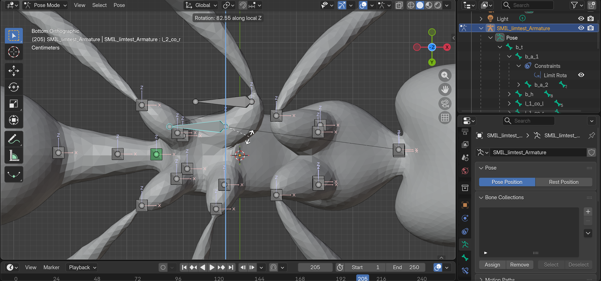
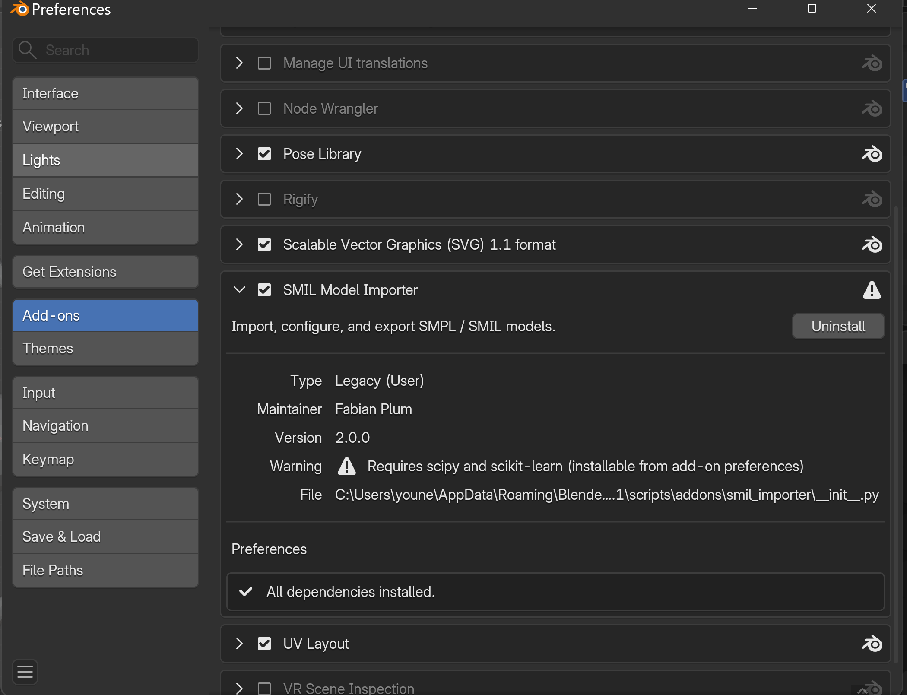
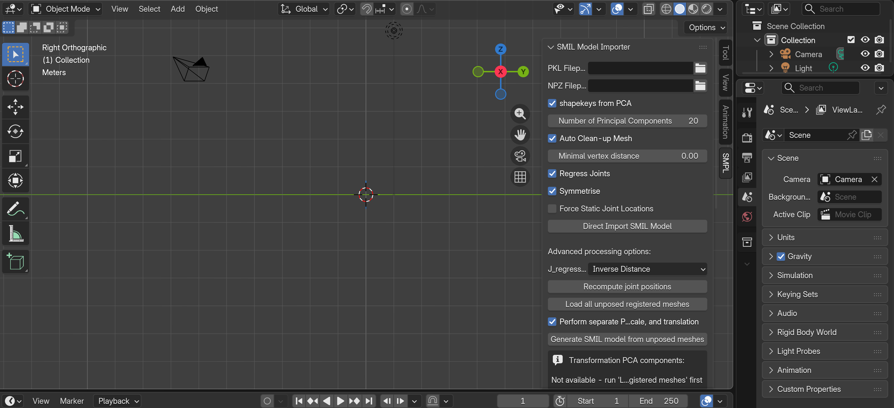
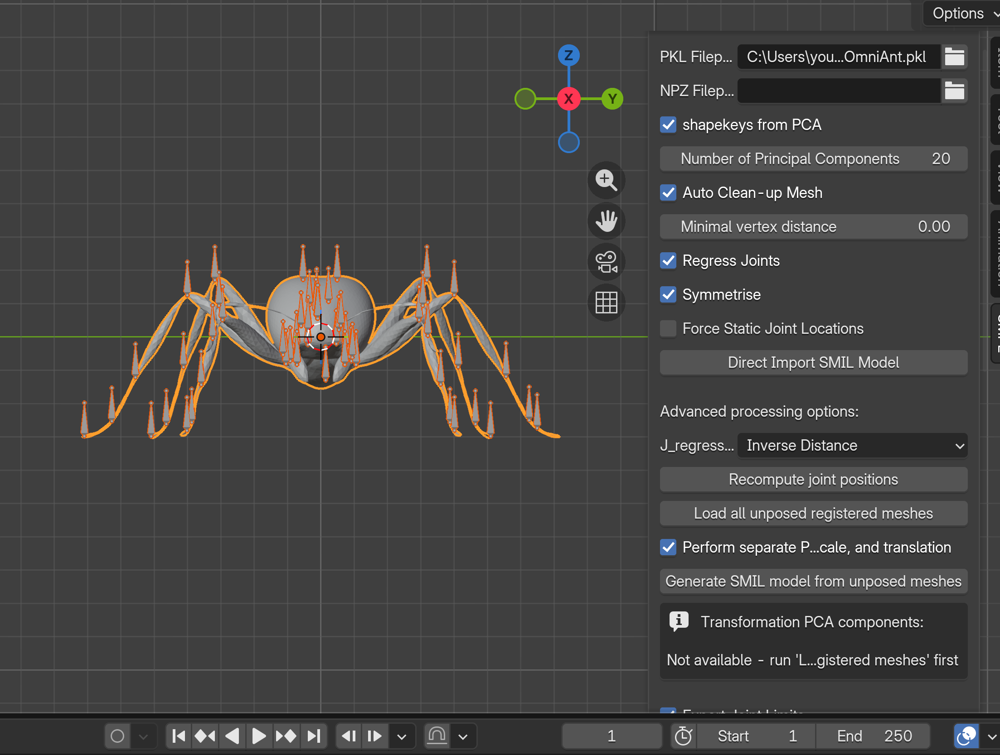
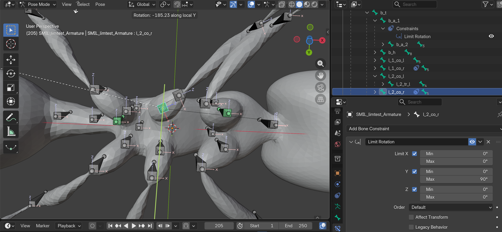
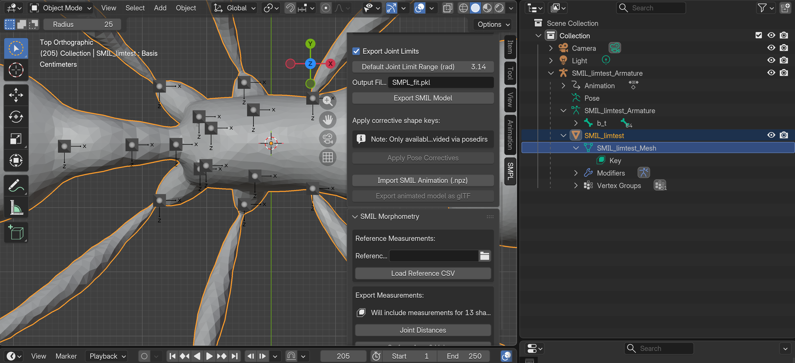

# Defining Joint Limits in Blender — User Guide

This guide shows, step by step, how to tell SMILify how far each joint of your model is allowed to rotate — e.g. "this knee bends between −30° and +45°". No coding needed: you draw the limits in Blender, export, and both fitting pipelines respect them automatically.

Technical details live in [issue56_implementation.md](design/issue56_implementation.md).

> 📷 All images below are placeholders — screenshots to be added. Each placeholder describes exactly what the photo should show.

---

## 1. Why joint limits?

When SMILify fits your model to images, it searches for a pose that matches. Without limits, it can find *impossible* poses — a leg bent backwards through the body. Joint limits fence off those poses: any joint that goes past its range gets penalised and is pulled back.

If you never set a limit on a joint, it stays "wide open" (free to rotate). You only need to author limits where anatomy demands them.

## 2. The one concept you must get right: axes and signs

Every joint can rotate around three axes — **X, Y, Z** — and each axis gets its own range `[Min, Max]`:

- **Min** = how far it can rotate in the *negative* direction (a negative number, e.g. −30°).
- **Max** = how far in the *positive* direction (e.g. +45°).
- `Min = Max = 0` means the axis is **locked** (no rotation at all).

**Which direction is "positive"?** That depends on the bone's own local axes — every bone carries its own little XYZ frame. Before typing numbers, always *look* at the bone's axes and *test-rotate* it (§4). Never guess the sign.



To display bone axes: select the armature → **Object Data Properties** (green stick-figure tab) → **Viewport Display** → tick **Axes**.


## 3. Setup (once)

1. Build and install the add-on:

   ```bash
   cd 3D_model_prep
   python build_addon.py
   ```

   In Blender: **Edit → Preferences → Add-ons → Install…**, pick `smil_importer.zip`, enable it.
2. Open your rigged model, import the`.pkl` model then **save the `.blend` file to a normal, writable folder**.





## 4. Find the right axis and sign (the sign-posting step)

For the joint you want to limit:

1. Select the **armature**, switch to **Pose Mode** (top-left dropdown or `Ctrl+Tab`).
2. Click the bone.
3. Test-rotate it around one *local* axis at a time: press `R`, then the axis letter **twice** (e.g. `R` `X` `X` — pressing twice selects the bone's *local* axis, once gives the global axis, which is not what you want). Move the mouse and watch which way the limb swings.
4. Note the direction: the way it swings when you move toward *positive* angles is your **Max** direction; the opposite is **Min**. Press `Esc` to cancel the rotation without keeping it.
5. Repeat for `R Y Y` and `R Z Z` until you know what each axis does for this bone.



Tip: the angle readout in the viewport corner shows the current angle *with its sign* while you rotate — this tells you directly whether "knee bends forward" is positive or negative on that axis.

## 5. Author the limit

Still in Pose Mode with the bone selected:

1. Open the **Bone Constraint** tab in the Properties editor — the icon is a **bone with a wrench**. Check the panel header says **"Add Bone Constraint"**, *not* "Add Object Constraint" (that one is a different tab and the exporter never reads it — pitfall #2).
2. Click **Add Bone Constraint → Limit Rotation**.
3. For each axis you want to limit:
   - **Tick the axis checkbox** (Limit X / Limit Y / Limit Z). An unticked axis is ignored and exports as wide-open, even if you typed numbers into its fields (pitfall #3).
   - Enter **Min** and **Max** in **degrees** (e.g. Min = −30, Max = 45).
4. Leave axes you don't want to limit unticked.
5. To **lock** an axis completely, tick it and set Min = Max = 0.
6. Set **Owner = Local Space** (see below). The default is World Space, which will export the wrong numbers.

### The "Owner" space setting (important)

At the bottom of the Limit Rotation panel there's an **Owner** dropdown. It's the coordinate space Blender measures the bone's rotation in before clamping it to your Min/Max:

- **World Space** (default) — measured against the global scene axes.
- **Pose Space** — relative to the armature's pose.
- **Local With Parent** — the bone's local frame, including its parent's rest orientation.
- **Local Space** — the bone's own local rest frame, ignoring the parent.
- **Custom Space** — relative to another object you pick.

**Set Owner = Local Space.** The exporter reads the raw Min/Max values and treats them as bone-local, then converts them into the model frame itself. Local Space is what makes "tick Z, −30/+45" mean "this bone rotates around *its own* Z", which matches the test-rotate step in §4 (`R Z Z` uses the bone's local axis). Any other Owner space measures against different axes, so your exported limits will fence off the wrong rotations.


Sanity check: with the constraint in place, test-rotate the bone again (`R Z Z`) — it should now visibly stop at your limits. If it stops in the wrong place, your sign is flipped: swap and negate (e.g. wrong `[-45, 30]` → right `[-30, 45]`).


## 6. Export

1. Select the **mesh object** (not the armature — pitfall #6).
2. In the SMIL panel, keep **Export Joint Limits** ticked (default), set the **Output Filename**, click **Export SMIL Model**.
3. Your limits are now stored inside the `.pkl` under the `joint_limits` key.



You do **not** need to worry about the bone's rest orientation: the exporter automatically converts your bone-local limits into the model's frame (for standard axis-aligned rigs the conversion is exact; a tilted, mixed-axis bone prints a warning and exports the numbers as-is).

### Verify the export (optional but recommended)

```python
import numpy as np
from smal_model.smal_torch import load_smal_model   # chumpy-safe loader
dd = load_smal_model("your_model.pkl")
jl = np.asarray(dd["joint_limits"])
print(jl.shape)                          # -> (J, 3, 2)
i = dd["J_names"].index("your_bone_name")
print(jl[i])                             # your limits, in RADIANS
print(jl[0])                             # root -> all zeros
```

The `.pkl` stores **radians**: −30° appears as `-0.5236`, +45° as `0.7854`. That's expected, not a bug (pitfall #4).

## 7. Use the limits

- **Optimisation fitter:** point `config.SMAL_FILE` at your exported `.pkl` and run with the limit weight on (`w_limit > 0`). Nothing else to configure.
- **Neural training (optional):** add `"joint_limit_regularization": 1e-3` (start small) to `loss_weights` in your training config. Default is `0.0` = off.

## 8. Common pitfalls (all seen in real testing)

1. **Unsaved `.blend`** → "Permission denied" on export. Save to a writable folder first.
2. **Object constraint instead of Bone constraint** → limit silently ignored. Use the bone+wrench tab.
3. **Unticked axis** → Min/Max fields are ignored; the axis exports wide-open. Tick the checkbox.
4. **Degrees vs radians** → Blender UI is degrees; the `.pkl` is radians.
5. **Wrong file checked** → export writes to the Output Filename on the machine running Blender; verify *that* file.
6. **Armature active at export** → "No valid mesh object selected." Select the mesh first.
7. **Flipped sign** → limit stops the bone on the wrong side. Test-rotate (§4/§5) and swap-negate the bounds.
8. **Owner left at World Space** → limits are measured against global axes, not the bone, so the exported bounds fence off the wrong rotations. Set Owner = Local Space (§5).