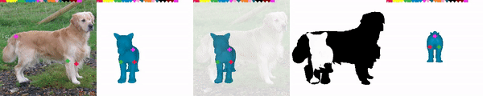

# Legacy functionality

This directory documents the **optimization-based** fitting workflow that SMILify inherited from [SMALify](https://github.com/benjiebob/SMALify). It is kept for compatibility, but fitting is now done primarily through the neural single-/multi-view pipeline — see the [root README](../README.md) and [smal_fitter/neuralSMIL/README.md](../smal_fitter/neuralSMIL/README.md). Use this path if you specifically need the gradient-descent `SMALFitter` (e.g. quadruped BADJA/StanfordExtra fitting, or building quadruped shape priors).

> The default config (`SEQUENCE_OR_IMAGE_NAME = "replicAnt:SMIL_09_synth.jpg"`, `ignore_hardcoded_body = True`) runs the fitter on a synthetic replicAnt ant image with an arbitrary rigged model. The BADJA/StanfordExtra/`SHAPE_FAMILY` instructions below apply only to the original SMAL **quadruped** pipeline (`ignore_hardcoded_body = False`).

## Installation

The optimization path uses the same conda environment as the rest of the repo — see [Installation](../README.md#installation) (`conda env create -f environment.yml`). The legacy quadruped datasets (BADJA / StanfordExtra / SMALST) come in as git submodules, so clone with `--recurse-submodules`.

For the original SMAL quadruped data:

1. Download [BADJA videos](https://drive.google.com/file/d/1ad1BLmzyOp_g3BfpE2yklNI-E1b8y4gy/view?usp=sharing) and unzip.
2. Inspect the directory paths in [config.py](../config.py) and make sure they match your system.

## QuickStart: Running the Fitter

Run on the default synthetic sample image generated with _[replicAnt](https://github.com/evo-biomech/replicAnt)_:


```
python smal_fitter/optimize_to_joints.py
```

Outputs are written to a timestamped directory `checkpoints/<YYYYMMDD-HHMMSS>/` (`config.OUTPUT_DIR`). Files named `stX_epY` mean stage X, iteration Y of the fitter; the final output is `st10_ep0` (`config.EPOCH_NAME`).

| Extension | Meaning |
| --- | --- |
| `.png` | Image visualization |
| `.ply` | Mesh file (view in e.g. [MeshLab](https://www.meshlab.net/)) |
| `.pkl` | Latest model/camera parameters |

### Create a video of the final fits

`smal_fitter/generate_video.py` loads the exported `.pkl` files and renders a video. This is useful if your `.pkl` files were created by alternative methods or your own research.

> **Current limitation:** `generate_video.py` reads `config.CHECKPOINT_NAME`, but `config.py` does **not** define `CHECKPOINT_NAME` by default — so the script raises `AttributeError` as shipped. Until this is fixed, add `CHECKPOINT_NAME = "<YYYYMMDD-HHMMSS>"` to `config.py` (the timestamped directory name under `checkpoints/` from your run). `EPOCH_NAME` defaults to `"st10_ep0"` (the final stage); set it to another `stX_epY` to render an intermediate result.

```
python smal_fitter/generate_video.py
```

The video is exported to `exported/`. Assemble the frames with e.g. [FFMPEG](https://ffmpeg.org/):

```
cd exported/<CHECKPOINT_NAME>/<EPOCH_NAME>
ffmpeg -framerate 2 -pattern_type glob -i '*.png' -pix_fmt yuv420p results.mp4
```

### Fit to a StanfordExtra image (quadruped)



Edit [config.py](../config.py) to load a [StanfordExtra](https://github.com/benjiebob/StanfordExtra) image instead of the default:

```
# SEQUENCE_OR_IMAGE_NAME = "replicAnt:SMIL_09_synth.jpg"
SEQUENCE_OR_IMAGE_NAME = "stanfordextra:n02099601-golden_retriever/n02099601_176.jpg"
```

```
python smal_fitter/optimize_to_joints.py
```

## Running on alternative data

### BADJA / StanfordExtra sequences (quadruped)

Follow the instructions for [BADJA](https://github.com/benjiebob/BADJA) or [StanfordExtra](https://github.com/benjiebob/StanfordExtra), then edit [config.py](../config.py):

| Config Setting | Explanation | Example |
| --- | --- | --- |
| `SEQUENCE_OR_IMAGE_NAME` | The sequence/image to fit | `badja:rs_dog` |
| `SHAPE_FAMILY` | Quadruped family — 0: Cat, 1: Canine (Dog), 2: Equine (Horse), 3: Bovine (Cow), 4: Hippo. **Only used when `ignore_hardcoded_body = False`**; the default config sets `SHAPE_FAMILY = -1` and ignores it. | `1` |
| `IMAGE_RANGE` | Frames to process from the sequence (ignored for StanfordExtra) | `[1,2,3]` or `range(0, 10)` |
| `WINDOW_SIZE` | Frames per batch for video sequences (tune to GPU capacity) | `10` |

### Running on your own data

Generate keypoint/silhouette annotations with [LabelMe](https://github.com/wkentaro/labelme):

```
labelme --labels data/LABELME/labels.txt --nosortlabels
```

> **Incomplete:** the legacy LabelMe → fitter import path was never finished — silhouette generation and a LabelMe-loading script remain TODOs carried over from upstream SMALify. For new data, prefer the neural pipeline's SLEAP preprocessing (see the [root README](../README.md)).

### Building your own quadruped deformable model

To represent a quadruped category not covered by SMAL (e.g. rodents/squirrels), use the [fitter_3d](../fitter_3d/) tool: fit the existing SMAL model to a collection of 3D artist meshes to learn a new shape space. See the [fitter_3d README](../fitter_3d/README.md).

## Improving performance — the loss weights (`OPT_WEIGHTS`)

`config.OPT_WEIGHTS` is a **9-row** array; each row holds one weight per optimization stage (the fitter runs in stages with different weights to avoid poor local minima — e.g. no 2D joint loss until an approximate camera is found, no silhouette loss until limbs are roughly placed). The rows are:

| Row | Component | Tips |
| --- | --- | --- |
| `Joint` | 2D keypoint reprojection | Increase if limbs don't match the input 2D keypoints after fitting. |
| `Sil Reproj` | 2D silhouette overlap | Increase if the reconstructed shape doesn't match (e.g. too thin). |
| `Betas` | 3D shape prior | Increase if reconstructions don't look animal-like. |
| `Pose` | 3D pose prior | Increase if limb configurations are implausible (legs in strange places). |
| `Joint limits` | Joint-limit prior | Suppressed in the original SMALify code. |
| `Splay` | Limb-splay regularizer | |
| `Temporal` | Inter-frame smoothness (videos only) | Adjust if limbs jitter between video frames. |
| `Num iterations` | Iterations per stage | Can usually be reduced for efficiency (defaults err on the cautious side). |
| `Learning Rate` | Learning rate per stage | |

## Licencing
(C) Fabian Plum, Imperial College London & Forschungs Zentrum Juelich & scAnt UG, Department of Bioengineering, and Benjamin Biggs, Oliver Boyne, Andrew Fitzgibbon and Roberto Cipolla. Department of Engineering, University of Cambridge 2020
