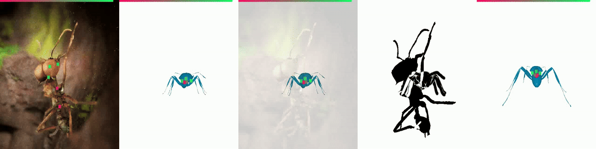

# Legacy functionality

The section below is here for legacy reasons, when this repo was first adapted from [SMALify](). The functionality is still intact for compatibility reasons, however fitting is now done primarily through deep neural networks for single and multi view applications. The section below will be moved to a "legacy" sub-directory soon.

## Installation (all functionality)
1. Clone the repository **with submodules** and enter directory
   ```
   git clone --recurse-submodules https://github.com/FabianPlum/SMILify
   ```
   Note: If you don't clone with submodules you won't get the sample data from BADJA/StanfordExtra/SMALST.
    
2. Install dependencies, particularly [PyTorch (cuda support recommended)](https://pytorch.org/), [Pytorch3D](https://github.com/facebookresearch/pytorch3d). Check [requirements.txt](https://github.com/benjiebob/SMALify/blob/master/requirements.txt) for full details.

3. Download [BADJA videos](https://drive.google.com/file/d/1ad1BLmzyOp_g3BfpE2yklNI-E1b8y4gy/view?usp=sharing) and unzip to `badja_extra_videos.zip`. 

4. Inspect the directory paths in [config.py](https://github.com/benjiebob/SMALify/blob/master/config.py) and make sure they match your system.

## QuickStart: Running the Fitter

- Run on a synthetic sample image generated with _[replicAnt](https://github.com/evo-biomech/replicAnt)_.
      
   - Run the python script
      ```
      python smal_fitter/optimize_to_joints.py
      ```
   - Inspect the SMALify/checkpoint directory to inspect the progress of the fitter. 
      - The output files stX_epY means, stage X and iteration Y of the fitter.
      - The final output is named st10_ep0 by (a slightly lazy) convention. 
      - The other files have the following meaning

         | Extension  | Explanation |
         | ------------- | ------------- |
         | .png  | Image Visualization  |
         | .ply  | Mesh file, can be viewed in e.g. [MeshLab](https://www.meshlab.net/)  |
         | .pkl  | Pickle file, contains the latest model/camera parameters |

   - Create a video with the final fits
      - The generate_video.py function loads the exported .pkl files generated during the fitting process and exports the data. This is generally usful if your .pkl files are created using alternative methods, e.g. Who Left the Dogs Out? (coming soon!) or your own research. 
      - Set CHECKPOINT_NAME in [config.py](https://github.com/benjiebob/SMALify/blob/master/config.py) to be the name of the output directory in SMALify/checkpoints.
      - By default the code will load the final optimized meshes, indicated by EPOCH_NAME = "st10_ep0". If you want to generate a video from intermediate results, set this to some different stage/iteration. 
      - Run the video generation script, which exports the video to SMALify/exported
         ```
         python smal_fitter/generate_video.py
         ```
      - Create a video using e.g. [FFMPEG](https://ffmpeg.org/):
         ```
         cd exported/CHECKPOINT_NAME/EPOCH_NAME
         ffmpeg -framerate 2 -pattern_type glob -i '*.png' -pix_fmt yuv420p results.mp4
         ```
- Fit to an image from [StanfordExtra](https://github.com/benjiebob/StanfordExtra) dataset.
   
   - Edit the [config.py](https://github.com/benjiebob/SMALify/blob/master/config.py) file to make load a StanfordExtra image instead of a BADJA video sequence:
      ```
      # SEQUENCE_OR_IMAGE_NAME = "badja:rs_dog"
      SEQUENCE_OR_IMAGE_NAME = "stanfordextra:n02099601-golden_retriever/n02099601_176.jpg"
      ```
   - Run the python script:
      ```
      python smal_fitter/optimize_to_joints.py
      ```

## Running on alternative data
### Alternative BADJA/StanfordExtra sequences:
- Follow the instructions for [BADJA](https://github.com/benjiebob/BADJA) or [StanfordExtra](https://github.com/benjiebob/StanfordExtra).
- Open the [config.py](https://github.com/benjiebob/SMALify/blob/master/config.py) file and make the following changes

   | Config Setting  | Explanation | Example |
   | ------------- | ------------- | ------------- |
   | SEQUENCE_OR_IMAGE_NAME  | Used to refer to your sequence/image  | badja:rs_dog
   | SHAPE_FAMILY            | Choose from 0: Cat, 1: Canine (e.g. Dog), 2: Equine (e.g. Horse), 3: Bovine (e.g. Cow), 4: Hippo |  1 |
   | IMAGE_RANGE  | Number of frames to process from the sequence. Ignored for StanfordExtra.  | [1,2,3] or range(0, 10) |
   | WINDOW_SIZE  | For video sequences, the number of frames to fit into a batch. Alter depending on GPU capacity. | 10 |
   
### Running on your own data
The first job is to generate keypoint/silhouette data for your input image(s). I recommend using [LabelMe](https://github.com/wkentaro/labelme), which is fantastic software that makes annotating keypoints / silhouettes efficient. 
   
- Install the software, and then load the joint annotation execute
   ```
   labelme --labels labels.txt --nosortlabels
   ```
- Next, generate the silhouette annotations
   ```
   # TODO
   ```
- TODO: Write script to load labelme files

### Building your own quadruped deformable model
If you want to represent an animal quadruped category which isn't covered by the SMAL model (e.g. perhaps you want to reconstruct rodents/squirrels), you can use the [fitter_3d](https://github.com/benjiebob/SMALify/tree/master/fitter_3d) tool. The basic idea is to fit the existing SMAL model to a collection of 3D artist meshes (you can download online) and thereby learn a new shape space. More information is given in the [README](https://github.com/benjiebob/SMALify/blob/master/fitter_3d/README.md).

## Improving performance and general tips and tricks
- For some sequences, it may be necessary to fiddle with the weights applied to each part of the loss function. These are defined in [config.py](https://github.com/benjiebob/SMALify/blob/master/config.py) in an OPT_WEIGHTS settings. The values weight the following loss components:

| Loss Component  | Explanation | Tips for Loss Weight
| ------------- | ------------- | ------------- |
| 2D Keypoint Reprojection  | Project the SMAL model with latest parameters and compare projected joints to input 2D keypoints | If your model limbs don't match well with the input keypoints after fitting, it may be worth increasing this. |
| 3D Shape Prior | Used to constrain the 3D shapes to be 'animal-like'. Note that (unlike equivalent human approaches that use mocap etc.) only artist data is used for this. | If your reconstructed animals don't look like animals, try increasing this. |
| 3D Pose Prior  | Used to contains the 3D poses to be anatomically plausible. | If your reconstructed animals have limb configurations which are very unreasonable, e.g. legs in strange places, try increasing this. |
| 2D Silhouette  | Project the SMAL model with latest parameters and compare rendered silhouette to input 2D silhouette. | If the shape of your reconstructed animal doesn't match well (e.g. maybe it's too thin?), try increasing this. |
| Temporal  | Constrain the change in SMAL parameters between frames. (Only for videos) | If your limbs move unnaturally between video frames, try adapting this. |

   Note that to avoid poor local minima, the optimization proceeds over multiple stages and the weights vary at each stage. For example, only once an approximate camera location has been found should there be 2D joint loss, and only once an approximate set of limb positions have been found should there be a 2D silhouette loss.

- To improve efficiency it is very likely that the number of iterations (again a setting in OPT_WEIGHTS) can be reduced for many sequences. I've err'd on the side of caution for this release by running many more iterations than probably needed.

## Licencing
(C) Fabian Plum, Imperial College London & Forschungs Zentrum Juelich & scAnt UG, Department of Bioengineering, and Benjamin Biggs, Oliver Boyne, Andrew Fitzgibbon and Roberto Cipolla. Department of Engineering, University of Cambridge 2020